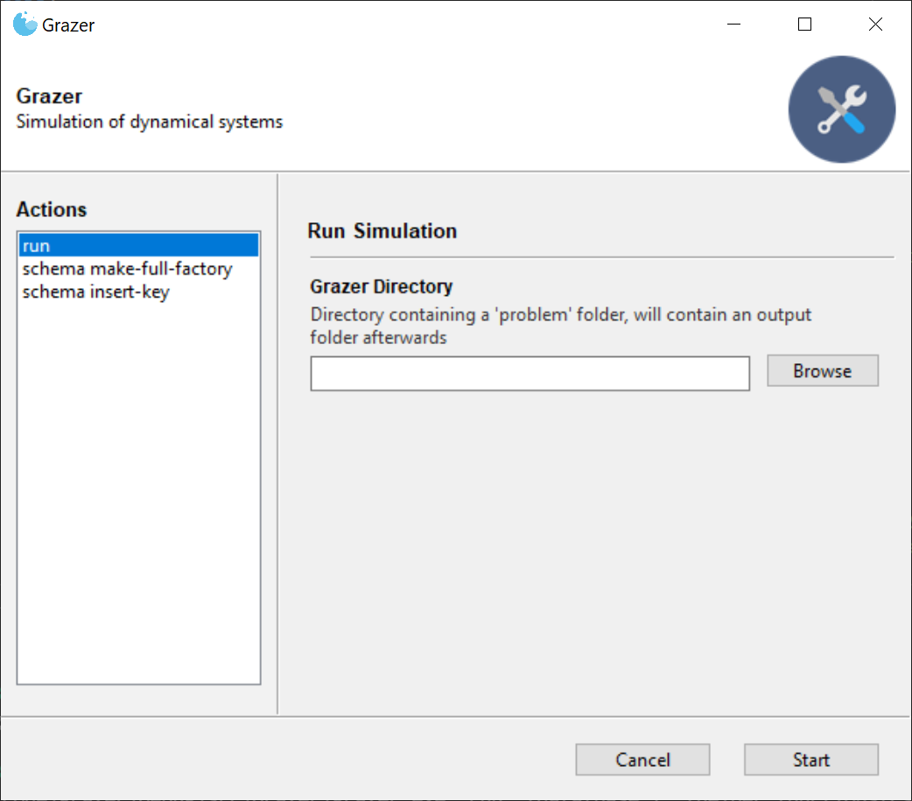

[](https://github.com/eike-fokken/grazer/releases)

## Grazer

Grazer is a program that shall simulate the time evolution of dynamical systems.
Input data is handed to grazer by json files.

This software is up to now only tested by one person, so expect some rough edges.
Yet feel free to dig into it.  Any feedback in github issues or to the mail address below is welcome.


## Installation
Before you can use grazer, you must build it.
Supported compilers are clang-9, gcc-9 and Microsofts Visual Studio 2019 as well as later version.
Other compilers may work and probably do as we strive for full standard compliance to C++17.

To build grazer, clone this git repository, change into it and run

```git submodule update --init --recursive --depth=1```

to fetch dependencies (`--depth=1` is not needed but cuts done the size tremendously.)

Then run

```cmake -DCMAKE_BUILD_TYPE=Release -DCMAKE_CXX_COMPILER=/usr/bin/clang++ -S . -B release```

and afterwards

```cmake --build release```

You can also build a debug build, just exchange 'release' with 'debug' and 'Release' with 'Debug'
everywhere in the last two commands.

After the build has completed, a binary named grazer (or grazer.exe , if built with mingw compiler)
will appear in `release/src/Grazer/`.

## Usage

Grazer provides both a command line interface (cli) and graphical user interface
(gui) both binaries can be downloaded from [our GitHub releases
page](https://github.com/eike-fokken/grazer/releases).

### Command Line Interface (CLI)

Grazer has a command line interface - running the executable with `--help` 
will look something like this:

```bash
$ grazer --help
Simulation of dynamical systems
Usage: grazer [OPTIONS] SUBCOMMAND

Options:
  -h,--help                   Print this help message and exit

Subcommands:
  run                         Simulate the evolution of the given dynamical system
  schema                      Schema Helpers for the JSON Schemas validating the input files

```

You can explore all grazer commands with `--help`. Commands usually expect a
`grazer_directory` argument, which is a directory with the following structure

```txt
grazer_directory
|- problem
|  |- problem_data.json
|  |- topology.json
|  |- ...
|- schemas
|- output
```

The `schema` and `output` folder can also be generated by grazer from `grazer
schema make-x` commands and `grazer run` respectively. Not even the
`problem` folder necessarily has to be there: If there are no files describing
the `problem` yet but one has ran the schema generation, `grazer schema
insert_link` will create empty problem files with just the `$schema` key
referencing the respective JSON schema. Schema-aware editors (like
[VSCode](https://code.visualstudio.com/)) will then provide you with
autocompletion when writing the simulation problem specification files.

(If you already have simulation problem specification files the same command
will only insert the `$schema` keys.)

Right now only Power and Gas networks are supported out of the box.
A few example problems can be found in the `data` subdirectory.
<<<<<<< HEAD
=======


### Graphical User Interface (GUI)

Grazer uses [Gooey](https://github.com/chriskiehl/Gooey) to provide a thin
GUI wrapper for the command line interface. 



> Note: Since Gooey is a python package
it would require an installation of python. To avoid this dependency we use
[pyinstaller](https://www.pyinstaller.org/) to package everything into an
executable. But this does mean we essentially ship a full python version with
the GUI, which increases Grazers size from something like 2mb to something like
20mb on windows and mac and even larger on linux.
>>>>>>> master

## Feedback
Feedback is welcome! Just open a github issue or write an email to

e.fokken+grazer@posteo.de


